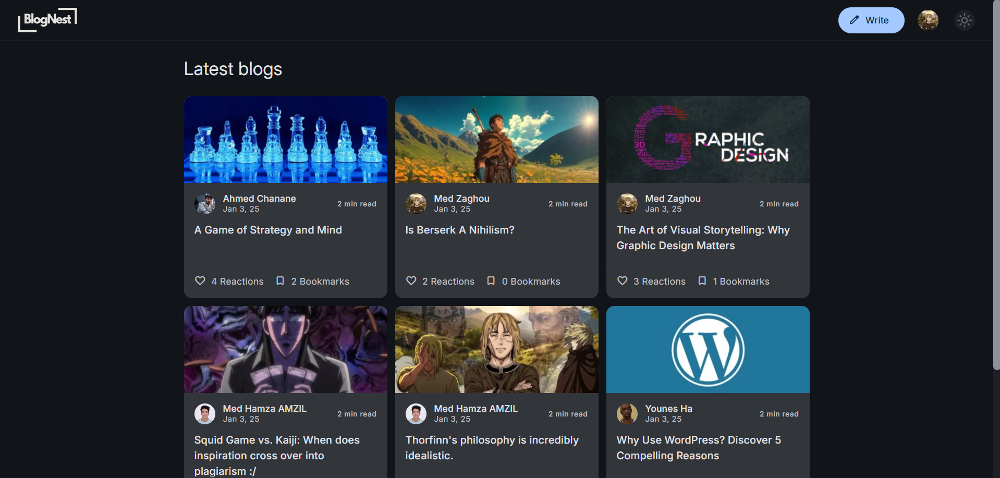
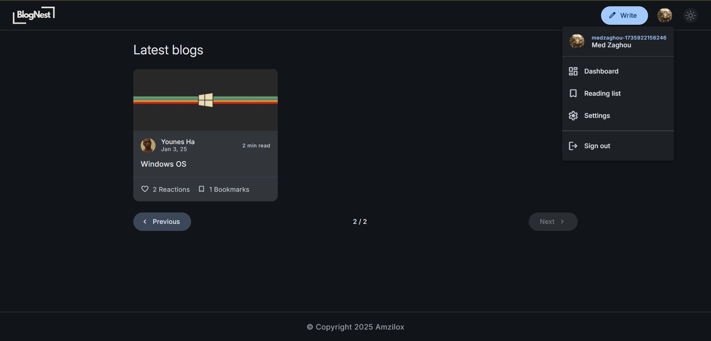
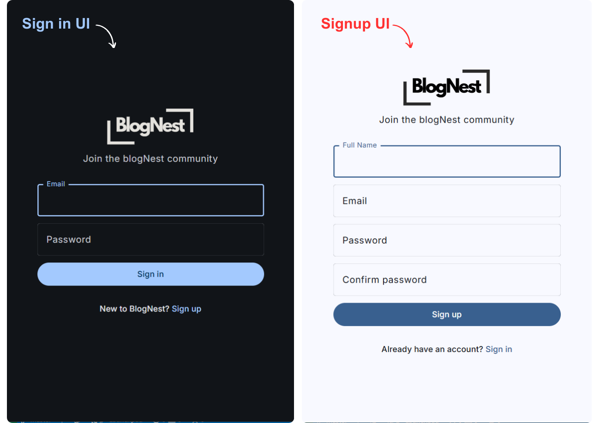
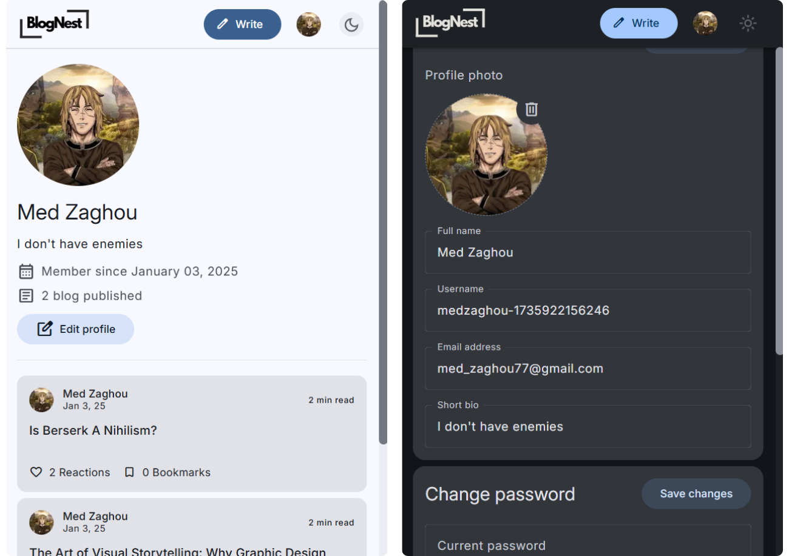

<h1 align="center">BlogNest 📝🌐</h1>

<h2 align="center">
Welcome to BlogNest – connecting minds through words! 📝💬
</h2>

<h2 align="center">
BlogNest – your platform for creating, sharing, and discovering insightful blogs!
</h2>

##

##

## Project Overview :

**BlogNest** is a full-stack web application that enables users to create, manage, and explore blog posts seamlessly. With support for both dark and light themes, it offers an engaging user experience tailored to individual preferences.

## Screenshots/Demo

## Key Technologies

- **<a href="https://ejs.co/" target="_blank">Server-Side Rendering with EJS</a>**: Delivers dynamic content efficiently.
- **<a href="https://developer.mozilla.org/en-US/docs/Learn_web_development/Core/CSS_layout/Responsive_Design" target="_blank">Responsive Design</a>**: Ensures optimal viewing across various devices.
- **[Theme Toggle]()**: Allows users to switch between dark and light modes.
- **<a href="https://www.sumologic.com/glossary/crud/#:~:text=CRUD%20is%20an%20acronym%20from,%2C%20read%2C%20update%20and%20delete." target="_blank">CRUD Functionality</a>**: Supports creating, reading, updating, and deleting blog posts.
- **<a href="https://www.mongodb.com/" target="_blank">MongoDB Integration</a>**: Utilizes Mongoose for robust data modeling.

## Technologies Used

- **Frontend**:
  - HTML, CSS (with theme support).
  - EJS (Embedded JavaScript Templates).
- **Backend**:
  - Node.js with Express.js framework.
  - MongoDB as the database.
  - Mongoose for object data modeling (ODM).

## Known Issues

⚠️ **Current Limitations:**

- **Console Errors:** Users may encounter occasional error messages in the browser console during use.
- **Security Enhancements Pending:** Plans are underway to implement additional security measures in future updates.

_Note: This is my first full-stack application, and I am actively working to address these issues in upcoming releases._

## Repository Status

🔒 **Private Repository Alert!** 🚨

This repository is currently private, so you won't be able to access it directly.

But don't worry! 😊

## Files Structure:

├── .editorconfig
├── .gitignore
├── LICENSE
├── app.js
├── package-lock.json
├── package.json
├── public
    ├── css
    │   └── style.css
    ├── images
    │   ├── dark-mode.svg
    │   ├── favicon.svg
    │   ├── light-mode.svg
    │   ├── logo-dark.svg
    │   ├── logo-light.svg
    │   └── profilePhoto-default.jpg
    └── js
    │   ├── bundle.js
    │   ├── bundle.js.map
    │   ├── config.js
    │   ├── count_visits.js
    │   ├── create_blog.js
    │   ├── delete_blog.js
    │   ├── dialog.js
    │   ├── login.js
    │   ├── reaction.js
    │   ├── reading_list.js
    │   ├── register.js
    │   ├── script.js
    │   ├── settings.js
    │   ├── snackbar.js
    │   ├── update_blog.js
    │   └── utils
    │       ├── LocalStorage_theme.js
    │       ├── imageAsDataUrl.js
    │       └── imagePreview.js
├── readme.md
├── screenshots
    ├── 1.png
    ├── 2.png
    ├── accueil-pagination.png
    ├── accueil.png
    ├── dashboard-mobile dark.png
    └── post-mobile dark.png
├── src
    ├── config
    │   ├── cloudinary_config.js
    │   ├── markdown_it_config.js
    │   └── mongoose_config.js
    ├── controllers
    │   ├── blog_delete_controller.js
    │   ├── blog_detail_controller.js
    │   ├── blog_update_controller.js
    │   ├── create_blog_controller.js
    │   ├── dashboard_controller.js
    │   ├── home_controller.js
    │   ├── login_controller.js
    │   ├── logout_controller.js
    │   ├── profile_controller.js
    │   ├── reaction_controller.js
    │   ├── reading_list_controller.js
    │   ├── register_controller.js
    │   ├── settings_controller.js
    │   └── visit_controller.js
    ├── middlewares
    │   └── user_auth.js
    ├── models
    │   ├── blog_model.js
    │   └── user_model.js
    ├── routes
    │   ├── blog_delete_route.js
    │   ├── blog_detail_route.js
    │   ├── blog_update_route.js
    │   ├── create_blog_route.js
    │   ├── dashboard_route.js
    │   ├── home_route.js
    │   ├── login_route.js
    │   ├── logout_route.js
    │   ├── profile_route.js
    │   ├── reading_list_route.js
    │   ├── register_route.js
    │   └── settings_route.js
    └── utils
    │   ├── generate_username.js
    │   ├── get_pagination.js
    │   └── get_reading_time.js
└── views
    ├── layouts
        ├── footer.ejs
        └── head.ejs
    ├── pages
        ├── 404.ejs
        ├── blog_detail.ejs
        ├── blog_update.ejs
        ├── create_blog.ejs
        ├── dashboard.ejs
        ├── home.ejs
        ├── login.ejs
        ├── profile.ejs
        ├── reading_list.ejs
        ├── register.ejs
        └── settings.ejs
    └── partials
        ├── card.ejs
        ├── list_item.ejs
        ├── pagination.ejs
        └── top_app_bar.ejs

I'm actively working on making it public soon.

Stay tuned for updates! 🚀

_Thank you for your interest and support!_ 🙏
